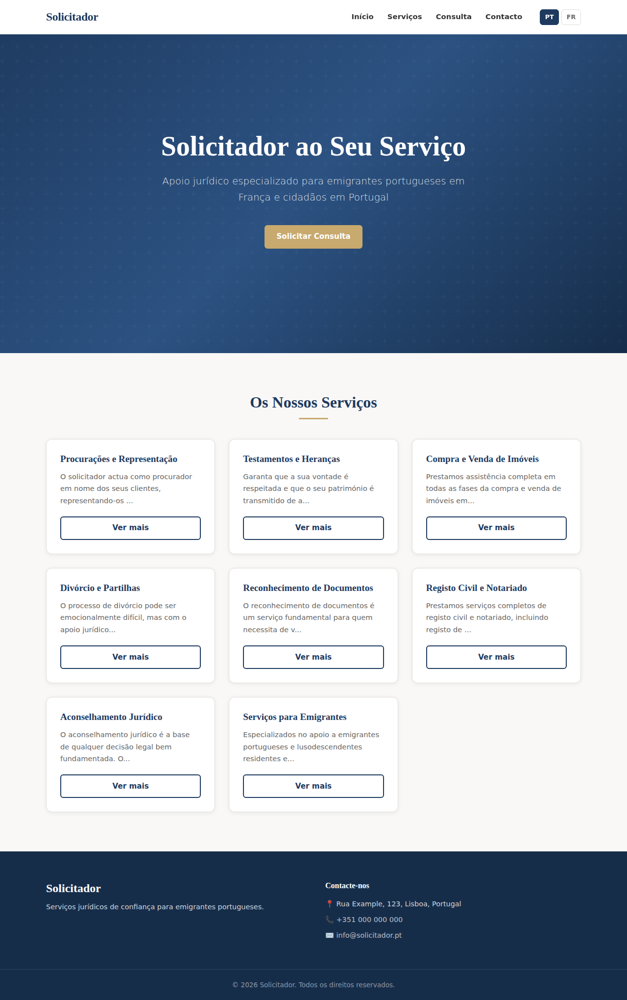
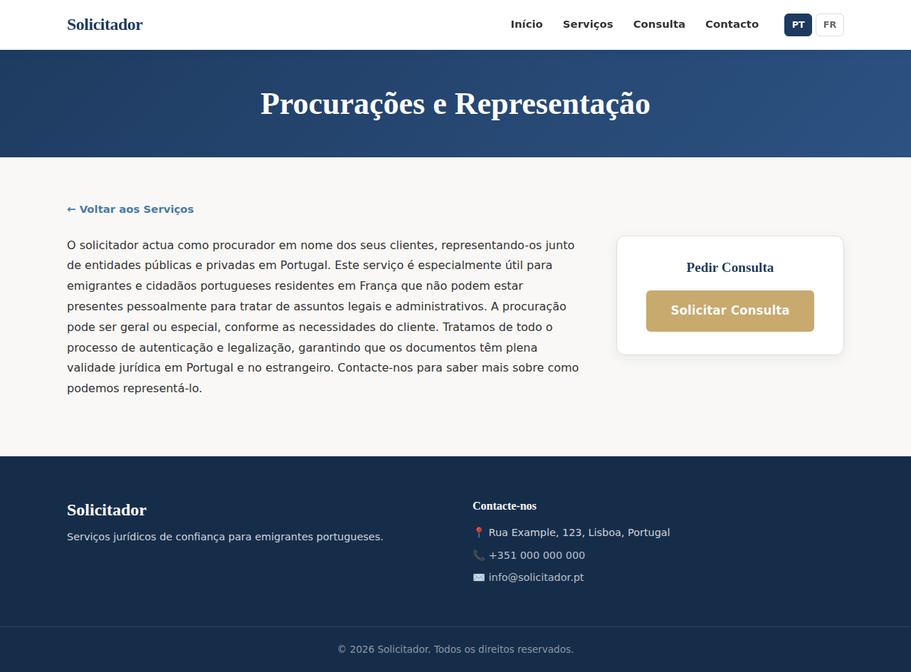
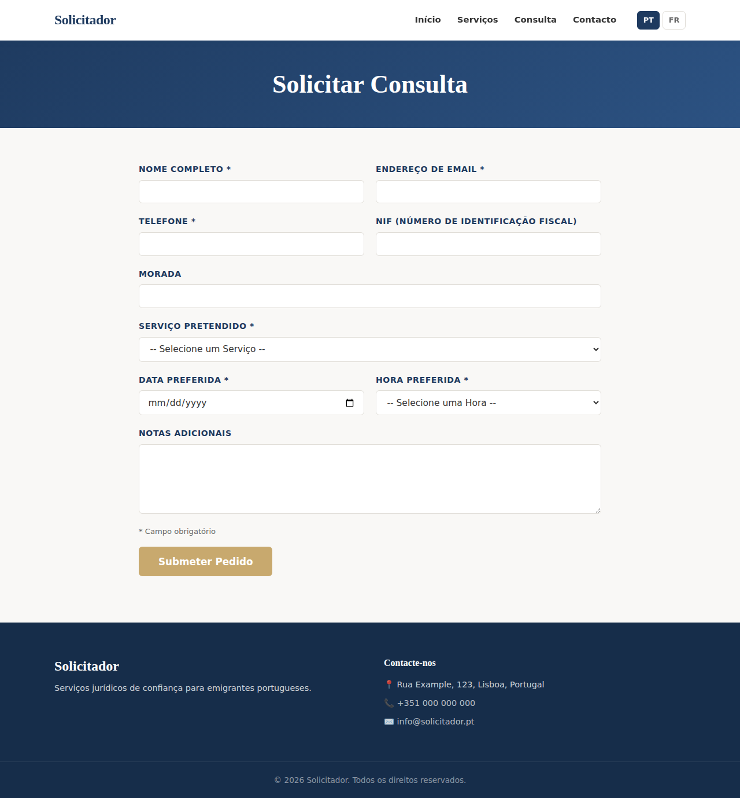
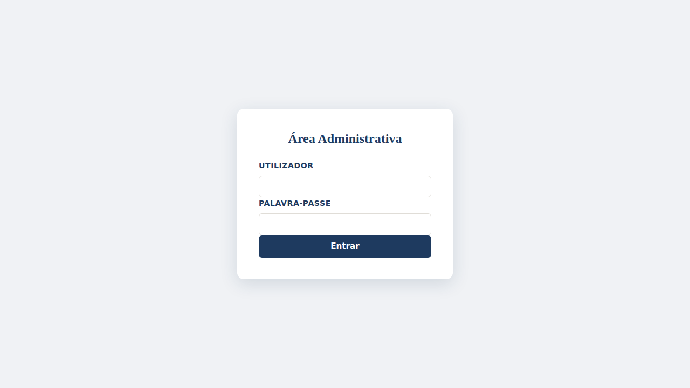
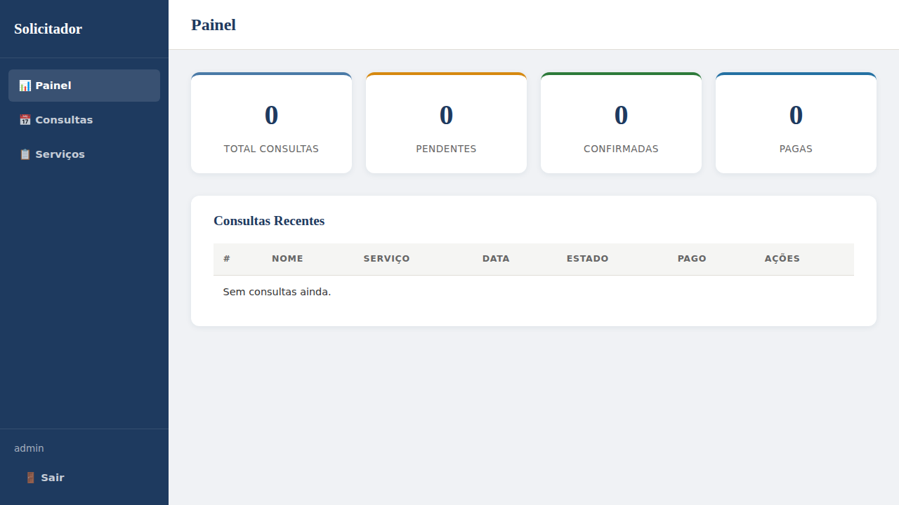
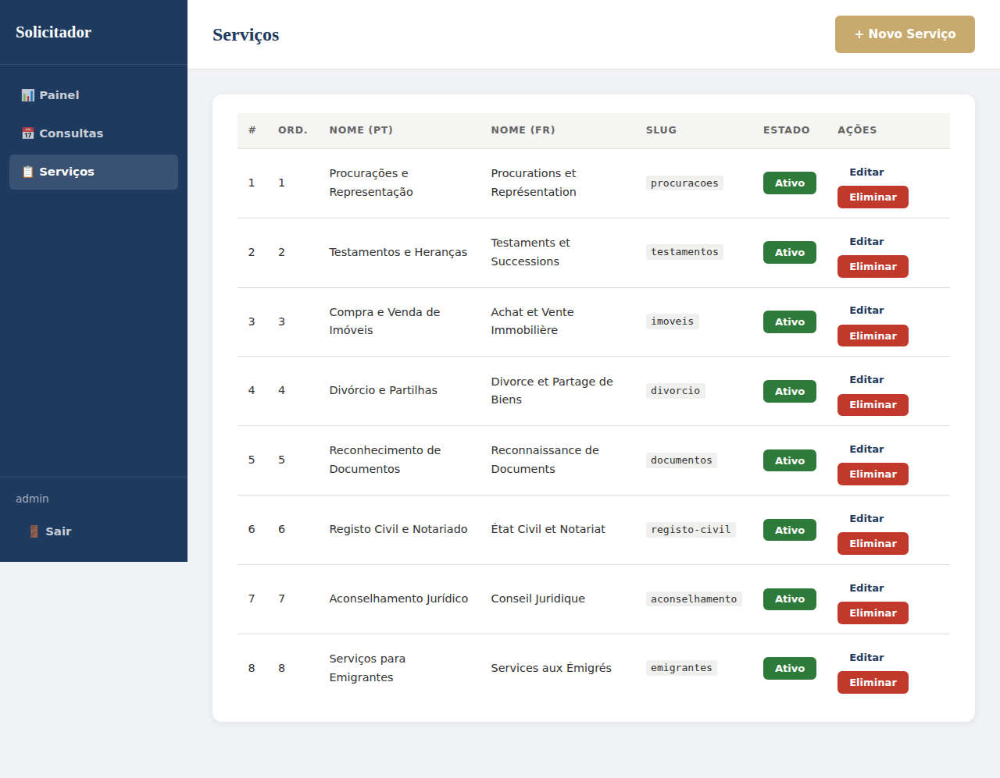
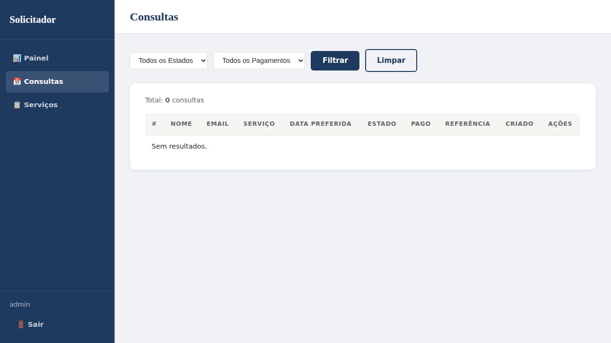

# Solicitador v3

A bilingual (Portuguese / French) legal services booking platform for Portuguese emigrants in France and citizens in Portugal. Clients can browse services, request consultations, and make appointments. Staff manage everything through a secure admin backoffice.

---

## Table of Contents

- [Features](#features)
- [Screenshots](#screenshots)
  - [Frontend (Public Site)](#frontend-public-site)
  - [Backoffice (Admin Panel)](#backoffice-admin-panel)
- [Requirements](#requirements)
- [Installation](#installation)
- [Project Structure](#project-structure)
- [Services Provided](#services-provided)
- [Functions & Pages](#functions--pages)
  - [Public Pages](#public-pages)
  - [Admin Pages](#admin-pages)
  - [Helper Utilities](#helper-utilities)
- [Security](#security)
- [License](#license)

---

## Features

- **Bilingual support** — full Portuguese (PT) and French (FR) interface with language switcher
- **Service catalogue** — 8 pre-configured legal services with detailed descriptions
- **Online booking** — consultation request form with date/time picker, validation, and payment reference generation
- **Admin dashboard** — statistics, recent appointments, and quick overview
- **Appointment management** — filter, view, update status, mark payments, and add internal notes
- **Service management** — create, edit, toggle active/inactive, reorder, and delete services
- **MySQL database** — compatible with shared hosting and phpMyAdmin
- **Responsive design** — works on desktop, tablet, and mobile
- **CSRF protection** — on all forms
- **Clean URLs** — via Apache mod_rewrite (e.g. `/service/procuracoes`)

---

## Screenshots

### Frontend (Public Site)

#### Homepage


#### Service Detail


#### Booking Form


### Backoffice (Admin Panel)

#### Admin Login


#### Dashboard


#### Services Management


#### Appointments Management


---

## Requirements

- **PHP 7.4+** (tested with PHP 8.x)
- **PDO MySQL extension** enabled (`pdo_mysql`)
- **MySQL 5.7+** or **MariaDB 10.3+**
- **Apache** with `mod_rewrite` enabled (for clean URLs and security headers)
- Write permissions on the `logs/` directory

---

## Installation

1. **Clone the repository**

   ```bash
   git clone https://github.com/markgir/solicitador-v3.git
   cd solicitador-v3
   ```

2. **Set directory permissions**

   Make sure the web server can write to the `logs/` directory:

   ```bash
   chmod 775 logs/
   ```

3. **Create the MySQL database**

   **Option A — Import via phpMyAdmin:**

   1. Open phpMyAdmin in your shared hosting panel
   2. Create a new database (e.g. `solicitador`)
   3. Select the new database, then go to the **Import** tab
   4. Upload the file `database/schema.sql` and click **Go**

   **Option B — Via command line:**

   ```bash
   mysql -u root -p -e "CREATE DATABASE solicitador CHARACTER SET utf8mb4 COLLATE utf8mb4_unicode_ci;"
   mysql -u root -p solicitador < database/schema.sql
   ```

4. **Configure database credentials**

   Copy the example configuration file and edit it with your database details:

   ```bash
   cp config.example.php config.php
   ```

   Open `config.php` and fill in your MySQL credentials:

   ```php
   return [
       'db_host' => 'localhost',
       'db_name' => 'solicitador',
       'db_user' => 'your_db_user',
       'db_pass' => 'your_db_password',
       'db_charset' => 'utf8mb4',
   ];
   ```

   > 📄 **Configuration file to edit:** `config.php` (in the project root)

5. **Configure your web server**

   Point the document root to the project folder. For Apache, ensure `mod_rewrite` is enabled:

   ```bash
   sudo a2enmod rewrite
   sudo systemctl restart apache2
   ```

   Alternatively, for local development, use the built-in PHP server:

   ```bash
   php -S localhost:8080
   ```

6. **Run the installer** *(alternative to phpMyAdmin import)*

   If you did not import `database/schema.sql` via phpMyAdmin, you can use the web installer instead.
   Open your browser and navigate to:

   ```
   http://localhost:8080/install.php
   ```

   This will:
   - Create the `services`, `appointments`, and `admin_users` tables in your MySQL database
   - Seed 8 legal services (in Portuguese and French)
   - Create a default admin user: **admin** / **admin123**

7. **Secure the installation**

   After installation, delete or restrict access to `install.php`:

   ```bash
   rm install.php
   ```

   Or uncomment the block in `.htaccess` to block access:

   ```apache
   <Files "install.php">
       Order Allow,Deny
       Deny from all
   </Files>
   ```

8. **Access the application**

   - **Public site:** [http://localhost:8080/](http://localhost:8080/)
   - **Admin panel:** [http://localhost:8080/admin/login.php](http://localhost:8080/admin/login.php)
   - Default credentials: `admin` / `admin123`

> ⚠️ **Important:** Change the default admin password after your first login.

---

## Project Structure

```
solicitador-v3/
├── admin/                      # Admin backoffice
│   ├── includes/
│   │   └── auth.php            # Authentication middleware
│   ├── index.php               # Dashboard
│   ├── login.php               # Login page
│   ├── logout.php              # Logout handler
│   ├── appointments.php        # Appointment list & filters
│   ├── appointment-detail.php  # View/edit a single appointment
│   ├── services.php            # Services list & management
│   └── service-edit.php        # Create/edit a service
├── assets/
│   ├── css/
│   │   └── style.css           # Main stylesheet
│   └── js/
│       └── main.js             # Client-side JavaScript
├── database/
│   └── schema.sql              # MySQL schema & seed data (import via phpMyAdmin)
├── docs/
│   └── screenshots/            # Application screenshots
├── includes/
│   ├── db.php                  # PDO MySQL database connection
│   ├── functions.php           # Helper functions (CSRF, translations, etc.)
│   ├── header.php              # HTML header template
│   └── footer.php              # HTML footer template
├── lang/
│   ├── pt.php                  # Portuguese translations
│   └── fr.php                  # French translations
├── logs/                       # Email log directory
├── .htaccess                   # Apache rewrite rules & security headers
├── .gitignore
├── config.example.php          # Database config template (copy to config.php)
├── config.php                  # ⚙️ YOUR database credentials (not in git)
├── booking.php                 # Booking request form
├── booking-confirm.php         # Booking confirmation page
├── index.php                   # Homepage
├── install.php                 # Installation / database seeding script
└── service.php                 # Service detail page
```

---

## Services Provided

The platform comes pre-loaded with 8 legal services (available in PT and FR):

| # | Service (PT) | Service (FR) | Slug |
|---|---|---|---|
| 1 | Procurações e Representação | Procurations et Représentation | `procuracoes` |
| 2 | Testamentos e Heranças | Testaments et Successions | `testamentos` |
| 3 | Compra e Venda de Imóveis | Achat et Vente Immobilière | `imoveis` |
| 4 | Divórcio e Partilhas | Divorce et Partage de Biens | `divorcio` |
| 5 | Reconhecimento de Documentos | Reconnaissance de Documents | `documentos` |
| 6 | Registo Civil e Notariado | État Civil et Notariat | `registo-civil` |
| 7 | Aconselhamento Jurídico | Conseil Juridique | `aconselhamento` |
| 8 | Serviços para Emigrantes | Services aux Émigrés | `emigrantes` |

---

## Functions & Pages

### Public Pages

| Page | URL | Description |
|---|---|---|
| **Homepage** | `/` | Hero section, service grid, language switcher (PT/FR), and call-to-action |
| **Service Detail** | `/service.php?slug={slug}` | Full service description with booking CTA. Also accessible via clean URL `/service/{slug}` |
| **Booking Form** | `/booking.php` | Consultation request form with fields for name, email, phone, NIF, address, service selection, date/time, and notes. Includes server-side validation and CSRF protection |
| **Booking Confirmation** | `/booking-confirm.php` | Displays payment reference (SOL-YYYYMMDD-XXXX), payment instructions (€80 bank transfer), and next steps |

### Admin Pages

| Page | URL | Description |
|---|---|---|
| **Login** | `/admin/login.php` | Secure login with bcrypt password verification and session management |
| **Dashboard** | `/admin/index.php` | Statistics cards (total, pending, confirmed, paid consultations) and recent appointments table |
| **Appointments** | `/admin/appointments.php` | Full appointment list with status and payment filters, pagination (20/page) |
| **Appointment Detail** | `/admin/appointment-detail.php?id={id}` | View client info, update status (pending → confirmed → completed → cancelled), update payment status (unpaid/paid), and add internal consultation notes |
| **Services** | `/admin/services.php` | List all services, toggle active/inactive, edit, delete, and create new services |
| **Service Editor** | `/admin/service-edit.php` | Create or edit a service with fields for slug, sort order, titles (PT/FR), descriptions (PT/FR), and active status |
| **Logout** | `/admin/logout.php` | Destroys session and redirects to login |

### Helper Utilities

| File | Functions |
|---|---|
| `includes/db.php` | `get_db()` — Returns a PDO connection to the MySQL database using credentials from `config.php` |
| `includes/functions.php` | `__()` — Translation helper, returns localized string by key. `csrf_token()` — Generates and returns a CSRF token for form protection. `verify_csrf()` — Validates the submitted CSRF token. `sanitize()` — Escapes HTML entities to prevent XSS. `log_email()` — Logs email events to `logs/email.log` |
| `includes/header.php` | Shared HTML header with navigation bar, language switcher, and responsive mobile menu |
| `includes/footer.php` | Shared HTML footer with contact information and copyright |
| `lang/pt.php` | Portuguese translation strings for all UI elements |
| `lang/fr.php` | French translation strings for all UI elements |

---

## Security

- **CSRF protection** on all forms (token generation and verification)
- **Password hashing** with bcrypt (`password_hash` / `password_verify`)
- **Input sanitization** via `htmlspecialchars()` to prevent XSS
- **Prepared statements** for all database queries (SQL injection prevention)
- **Session management** with session regeneration on login
- **`.htaccess` protections:**
  - Directory listing disabled
  - `.db`, `.sqlite`, and `.log` files blocked from HTTP access
  - Security headers: `X-Content-Type-Options`, `X-Frame-Options`, `X-XSS-Protection`, `Referrer-Policy`

---

## License

This project is proprietary. All rights reserved.